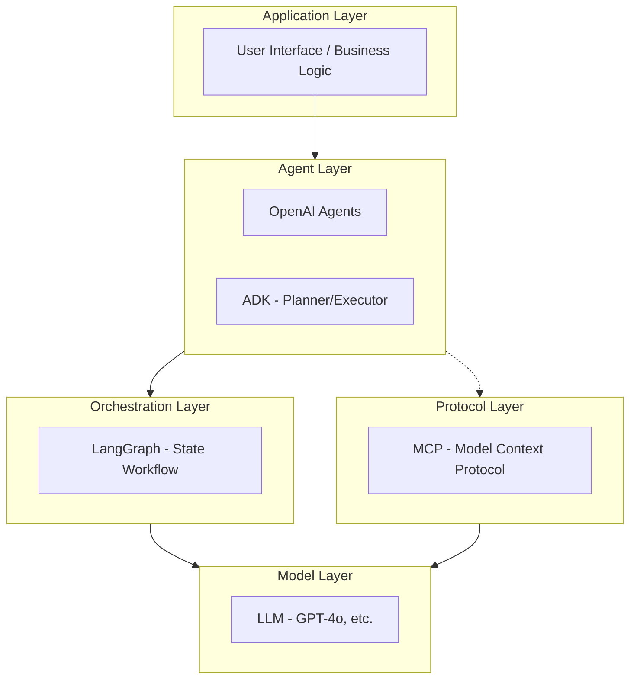
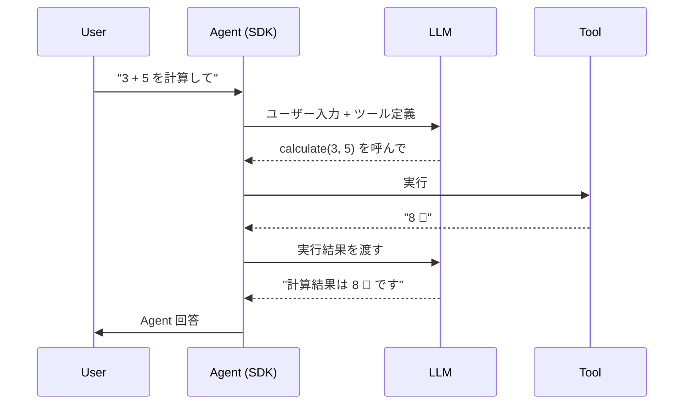
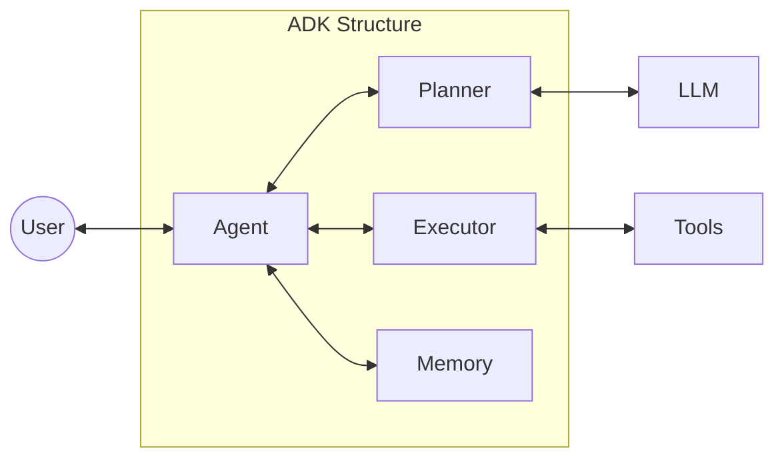
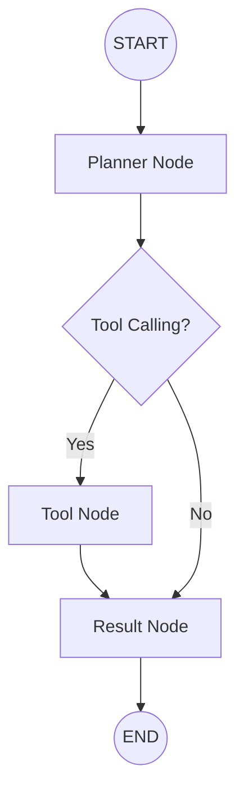
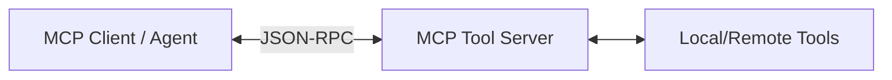

# AIエージェント基盤 Hello World 4連装

本リポジトリは、主要な AI エージェント実装方式を「全部まとめて」俯瞰し、それぞれの設計思想やレイヤー構造の違いを理解・実装できる状態にすることを目的とした教材リポジトリです。

## 🎯 目的

「エージェント関連技術を一通り使えるようになる」という学習目的のもと、以下の 4 方式を並列に実装しています：

- **OpenAI Agents**: LLM 標準の Agent 実装
- **ADK**: 業務 Agent 向けの責務分離アーキテクチャ
- **LangGraph**: 状態遷移を明示したワークフロー型 Agent
- **MCP**: Agent 基盤を支えるプロトコル層

これらは競合ではなく**補完関係**にあり、レイヤーが異なるだけで同じエコシステム上に存在しています。本リポジトリを通じて、Agent 技術スタックの地図を完成できます。

---

## 🧠 Agent 技術スタック全体像

エージェントシステムは、一般的に以下のレイヤーで構成されます。各方式がどのレイヤーを主眼に置いているかを整理します。



---

## 📐 Architecture Comparison

各方式の設計思想を Mermaid 図で比較します。

### 1. OpenAI Agents (Tool Calling 型)
LLM が直接ツールを選択し、ループを回す最もシンプルな構成です。


### 2. ADK (Planner / Executor / Memory 分離型)
思考(Planner)、実行(Executor)、記憶(Memory)の責務を明確に分けた構造です。


### 3. LangGraph (State Graph 型)
エージェントの動作を状態遷移（グラフ）として定義し、制御フローを可視化します。


### 4. MCP (Protocol & Tool Server 型)
クライアントとサーバー間の通信プロトコルを標準化し、ツールの再利用性を高めます。


---

## 📊 比較対応表

### 1. レイヤー構造対応表

| 概念レイヤー        | OpenAI Agents | ADK             | LangGraph     | MCP           |
|---------------|---------------|-----------------|---------------|---------------|
| **LLM**       | OpenAI API    | LLM Adapter     | ChatModel     | Client (Host) |
| **Planning**  | LLM (Native)  | Planner         | Router Node   | - (Client 依存) |
| **Execution** | Tool Calling  | Executor        | Node / Tool   | Tool Server   |
| **Memory**    | Chat History  | Memory Class    | State (Graph) | Context       |
| **Transport** | HTTPS (SDK)   | Python Internal | Managed State | MCP Protocol  |

### 2. 責務比較

| 観点       | OpenAI Agents | ADK         | LangGraph | MCP        |
|----------|---------------|-------------|-----------|------------|
| **設計思想** | LLM 主導        | Agent 分業    | 状態遷移      | 標準化・分離     |
| **構造**   | 単一 Agent      | 多層/分業 Agent | グラフベース    | クライアント/サーバ |
| **拡張性**  | 低             | 中           | 高         | 非常に高       |
| **運用**   | シンプル          | 業務ロジック向け    | 複雑なフロー向け  | エコシステム基盤向け |

### 3. 実装規模比較 (Python 実装例)

| 方式                | フォルダ               | ファイル数 | 推定行数 | 主要依存ライブラリ                       |
|-------------------|--------------------|-------|------|---------------------------------|
| **OpenAI Agents** | `openai-agent/`    | 2     | ~130 | `openai`                        |
| **ADK**           | `adk-agent/`       | 2     | ~150 | `openai`                        |
| **LangGraph**     | `langgraph-agent/` | 2     | ~140 | `langgraph`, `langchain-openai` |
| **MCP**           | `mcp-agent/`       | 4     | ~100 | `mcp`, `anyio`                  |

---

## 🚀 ユースケース別の使い分け指針

| ユースケース          | 推奨方式          | 理由                           |
|-----------------|---------------|------------------------------|
| **クイックプロトタイプ**  | OpenAI Agents | 最小限のコードで動作し、LLM の能力を直接活かせる。  |
| **業務アプリケーション**  | ADK           | 思考と実行のログが追いやすく、カスタマイズ性が高い。   |
| **複雑な条件分岐・ループ** | LangGraph     | ワークフローを可視化・制御でき、長期的な状態管理に適す。 |
| **ツール共有・外部基盤**  | MCP           | 一度作ったツールを異なるエージェント間で使い回せる。   |

---

## 🛠️ セットアップ

```bash
# 依存関係のインストール
pip install -r requirements.txt

# 環境変数の設定
# .env ファイルを作成し、OPENAI_API_KEY を設定してください
cp .env.example .env
```

## 🏃 実行コマンド

| 方式            | コマンド                             |
|---------------|----------------------------------|
| OpenAI Agents | `python -m openai-agent.main`    |
| ADK           | `python -m adk-agent.main`       |
| LangGraph     | `python -m langgraph-agent.main` |
| MCP           | `python -m mcp-agent.main`       |

---

## 📝 まとめ

- Agent は「**構造設計**」の問題である。
- 各フレームワークは異なる**設計思想（メンタルモデル）**を提供している。
- レイヤー構造を理解することで、課題に対して最適な技術を選択できるようになる。

---
© 2024 AI Agent Hello Worlds
