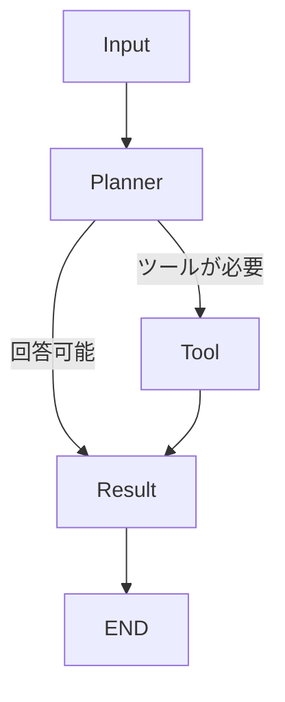

# LangGraph Agent

LangGraph による状態遷移型エージェントの Hello World 実装。

## 構成

LangGraph を使用し、エージェントの動作をグラフ（状態遷移）として定義しています。
各ステップは独立した「Node」として定義され、状態（State）を介して情報を受け渡します。

### グラフ構成図



## 実装のポイント

- **State 管理**: `AgentState` (TypedDict) を使用してメッセージ履歴を保持します。
- **Node 構成**:
    - `Planner`: LLM を用いて、次にツールを呼ぶか回答するかを決定します。
    - `Tool`: LLM の指示に従い、実際に計算ツールを実行します。
    - `Result`: ツールの実行結果などを踏まえ、ユーザーへの最終回答を生成します。
- **条件遷移**: `should_continue` ルーターにより、LLM の出力（tool_calls の有無）に応じて次に進むべきノードを動的に切り替えます。

## 実行方法

```bash
python -m langgraph-agent.main
```
